## About Data Cleanser
---
Data Cleanser is an API made using Flasgger. It aimed to cleanse data (specifically X or Twitter data), such as removing punctuations and removing whitespace.

It has two endpoints.
- **inputForm**: user can input the text manually here
- **uploadCSV**: user can upload CSV file here

After being cleansed, the data will be visualized through pie chart, bar chart, and wordcloud to help user gain insights. The data visualization will be stored as png format while the data cleansed will be stored as db format (sqlite3).

## <b>How to Run Data Cleanser</b>
---
1. Clone this repository
2. Install module needed by running this code
> pip install -r requirements. txt
3. Run the app
> python data-cleanser.py
4. Open browser and go to link below
> http://127.0.0.1:5000/docs/

Successful deployment will result below.
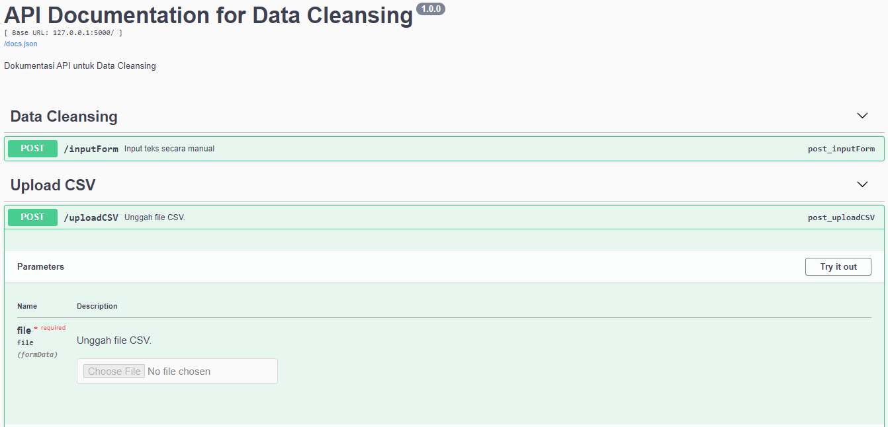 

## 
<b>Analysis Report</b>

---
### <b>Introduction</b>

Social media is a platform where people can express their opinions freely, including hate speech. Hate speech can be related to politics, racism, religion, and so on. In many cases, hate speech is also often accompanied by the use of abusive words. Apart from creating an unhealthy environment, abusive words themselves often distract from the point of the text. Apart from abusive words, slang words are also often used on social media. In fact, these words can make it difficult for readers to understand the text.

Based on these problems, further analysis is needed regarding text cleaning to make it easier to read as well as analyzing the pattern of tweets in cyberspace, both hate speech and non-hate speech, and how they are characterized

Therefore, the purpose of this study is to clean the text from abusive words and slang words, identify words related to hate speech, compare hate speech and non-hate speech tweets, and analyze the relationship between hate speech and abusive words.

---

### <b>Research Method</b>
#### Dataset Used

Datased used was obtained from [here](https://www.kaggle.com/datasets/ilhamfp31/indonesian-abusive-and-hate-speech-twitter-text). It was collected by Muhammad Okky Ibrohim and Indra Budi and contained 3 datasets.
- **data.csv**: the inputted dataset. This data will be processed with the application.
- **new_kamus_alay.csv**: dataset containing Indonesian slang words and normal words.
- **abusive.csv**: dataset containing a set of Indonesian abusive words.

#### Data Cleansing

Data cleansing applied in this study includes:

* Removing hashtag
* Removing “USER”, “URL”, and link (https:/….)
* Removing “\n” or enter
* Removing punctuations
* Transforming slang words to normal words
* Censoring abusive words into ****
* Fixing whitespace

The output of data cleansing will be stored as sqlite3 named "output.db".

#### Data Analysis Method

The method used is descriptive analytics to find out the condition of the data. Exploratory Data Analysis was also applied. After that, missing values and duplicates were checked and removed (if there was any). Beside that, descriptive statistics were also used to provide a concise overview of the data.

#### Data Visualization

Data visualization in this study used pie chart, bar chart, and wordcloud. Wordcloud is applied to each class after removing Indonesian stopwords. Visualization conducted will be stored as png file in "image" directory.

---

### <b>Results and Conclusions</b>

Based on the analysis that has been carried out, the following results and conclusions are obtained.
- Data does not have missing values but has duplicate data.
EDA shows that hate speech and abusive classes have a weak positive correlation.
- Hate speech with a weak type has a strong positive correlation with hate speech directed at individuals, while hate speech with a moderate type has a strong positive correlation with hate speech directed at groups.

Based on the visualization that has been done, the following results and conclusions are obtained.
- Pie chart
    - There are 7526 non-hate speech tweets and 5518 hate speech tweets.
    - A total of 3262 hate speech tweets contain abusive words (59%), while 2256 hate speech tweets do not contain abusive words.

- Bar chart
    - The most common type of hate speech is "other", directed at individuals, and weak in nature.

- Wordcloud
    - The most common words used in hate speech tweets were "jokowi", "indonesia", "people", "china", and "ahok".
    - The most common words used in non-hate speech tweets are "people", "president", "religion", "islam", and "indonesia".

Overall, it can be concluded that the word "jokowi" was the most frequently used word in both general tweets and hate speech. However, the non-hate speech wordcloud shows that jokowi is not frequently mentioned. This shows that **the intensity of hate speech directed at President Jokowi is very high**. The word "jokowi" itself is related to other frequently mentioned words, such as "president", "country", "people" and "indonesia".

---

### <b>Visualization</b>

#### Pie Chart
##### Comparison of Number of Hate Speech and Non-Hate Speech Tweets

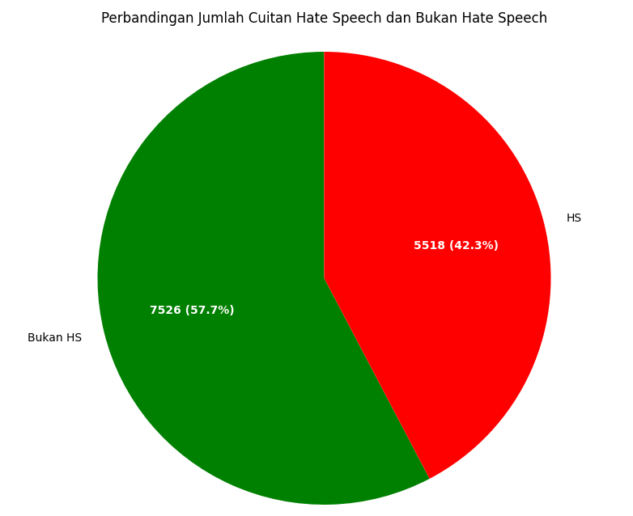

##### Comparison of Number of Abusive Hate Speech and Non-Abusive Hate Speech Tweets

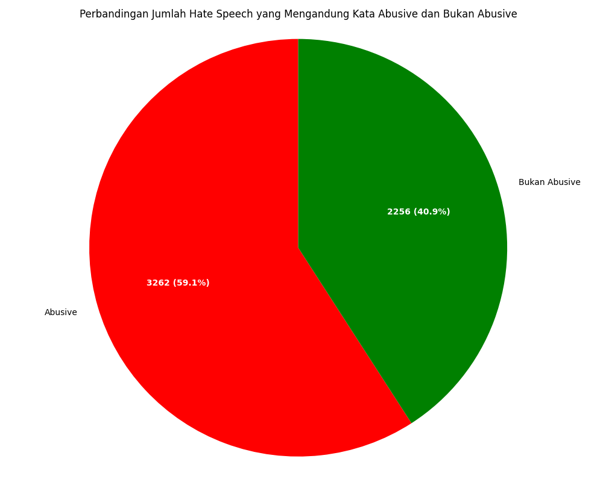 

#### Bar Chart
##### Distribution of Hate Speech Type
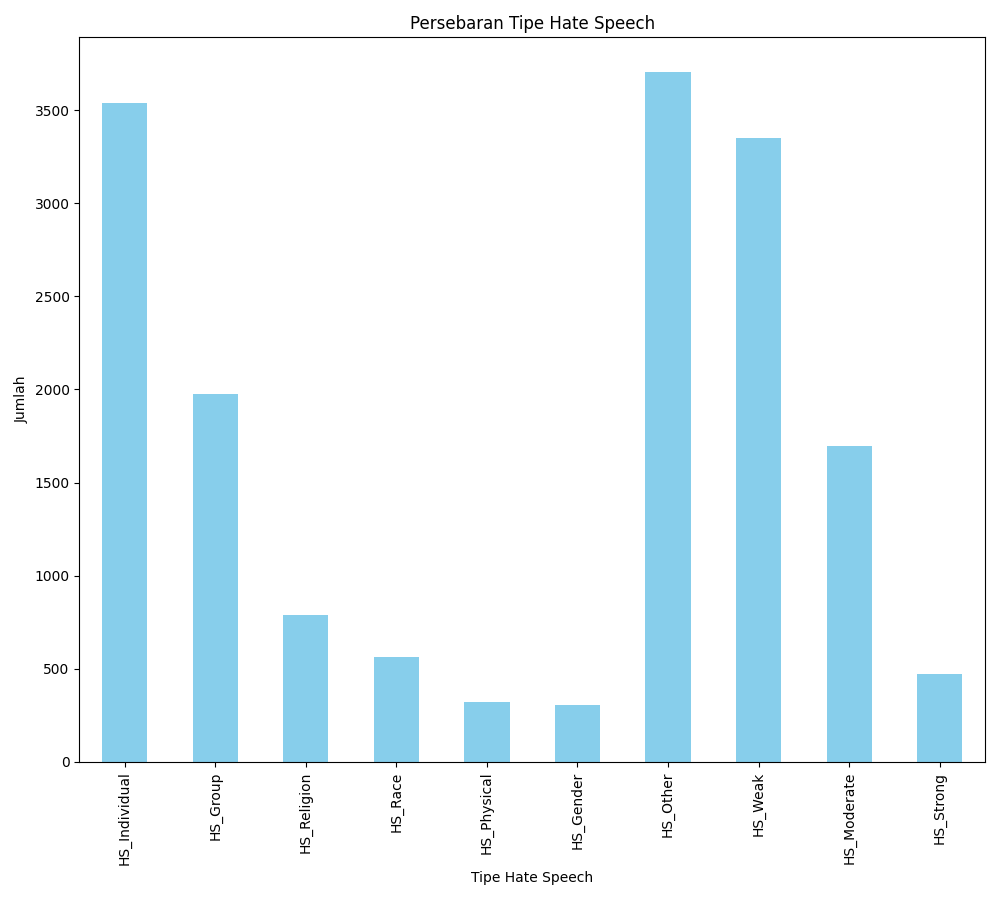

##### Distribution of Abusive Hate Speech Type
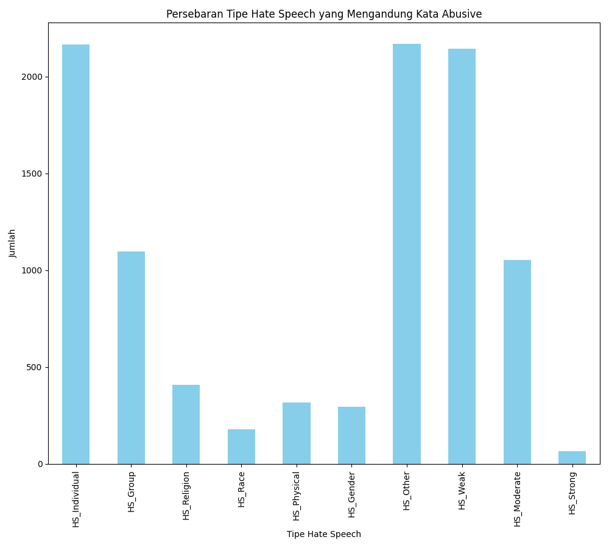

#### Wordcloud*
##### Wordcloud of All Tweets
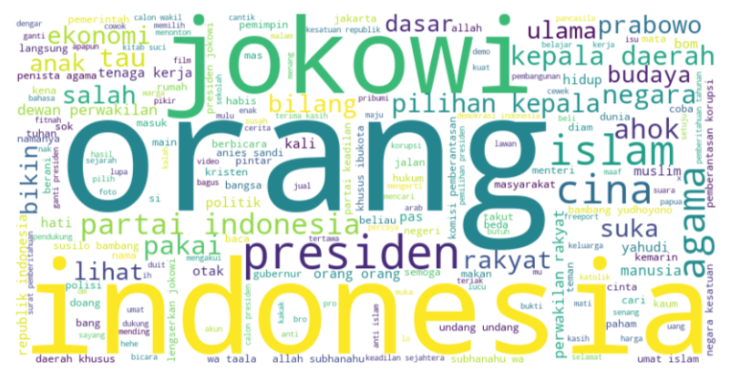

##### Wordcloud of Hate Speech Tweets
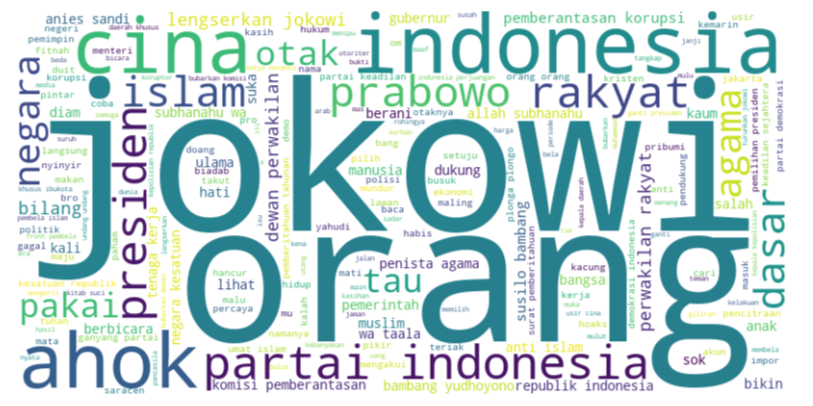

##### Wordcloud of Non-Hate Speech Tweets
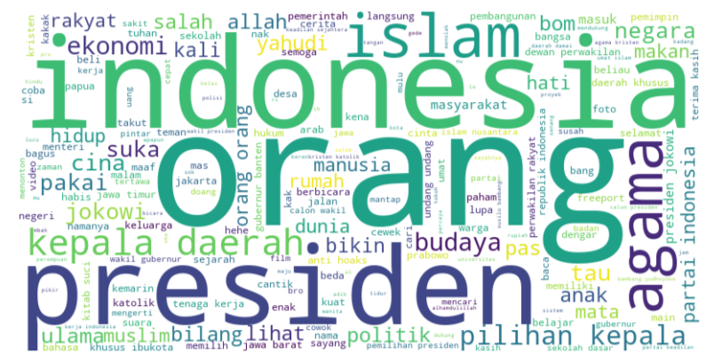

<i>*wordclouds of each class can be accessed through "img_md" directory</i>

## 
<b>Gallery</b>

---

### Example of inputForm

---

### JSON Response of Successful uploadCSV

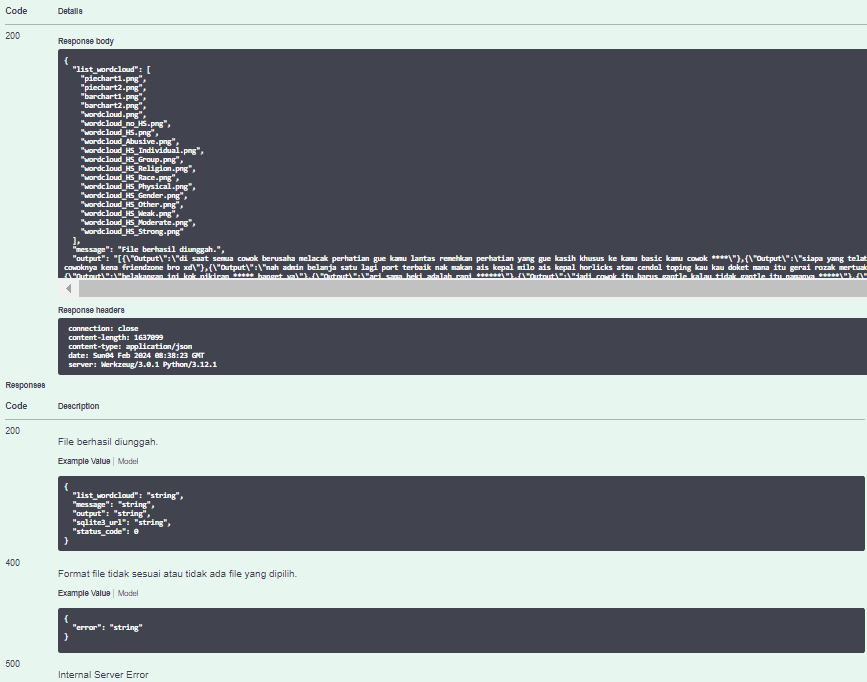

---

### Exploratory Data Analysis

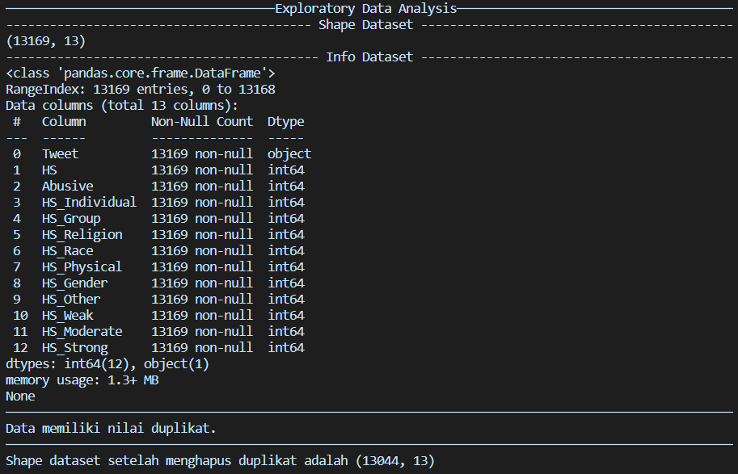

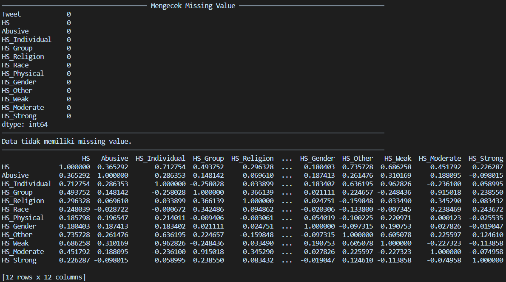

---

### Data Before Cleansing (data.csv)

---

### Data After Cleansing (output.db)

